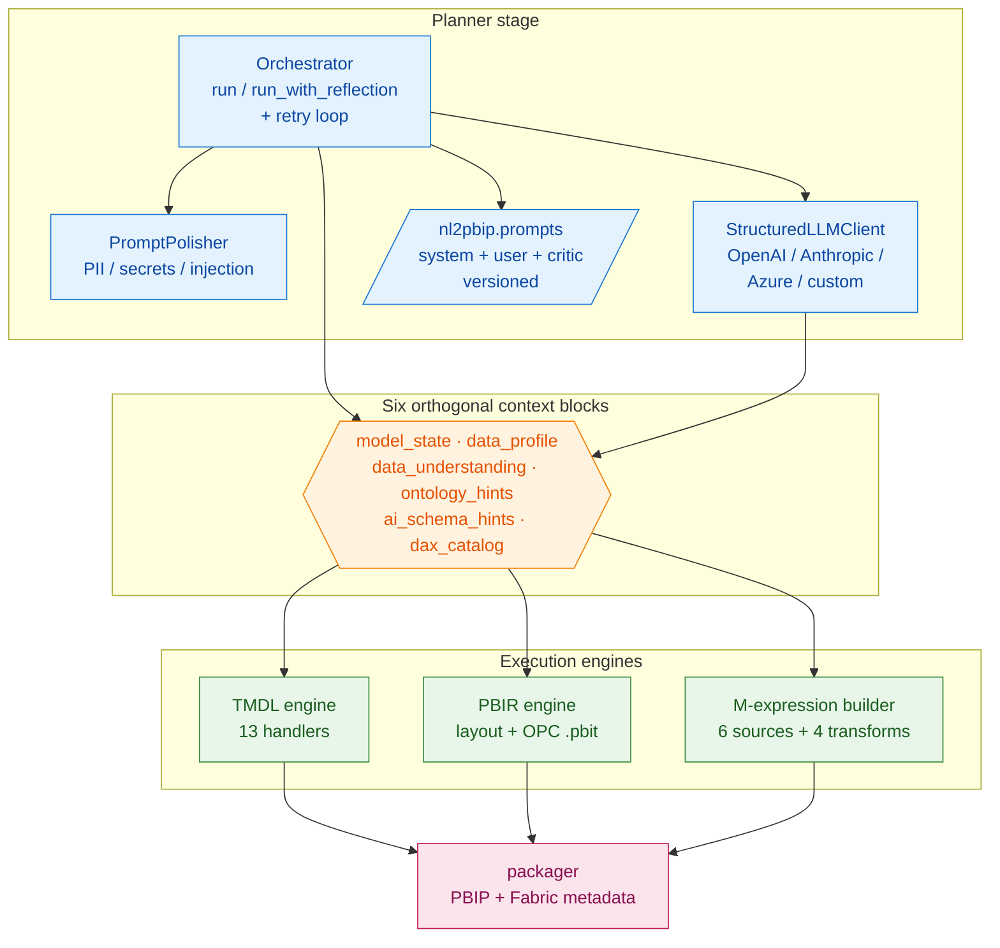
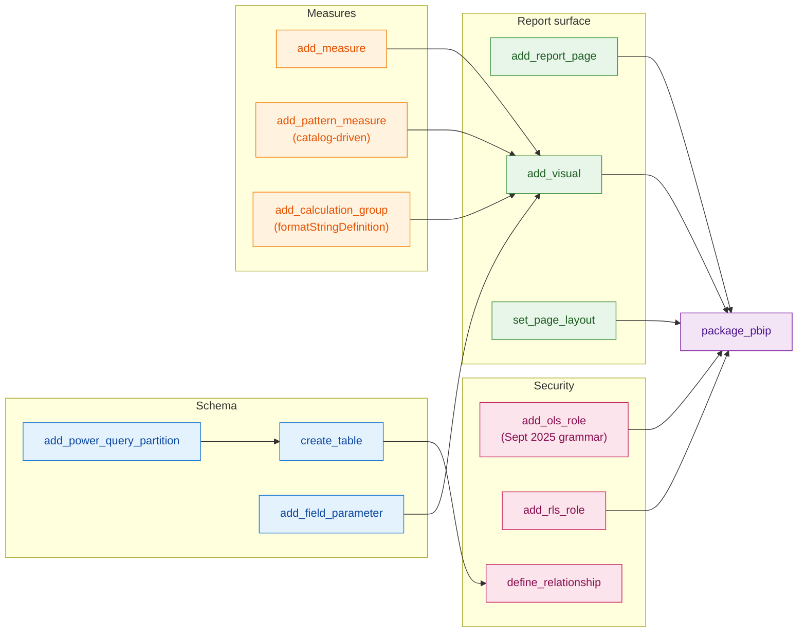
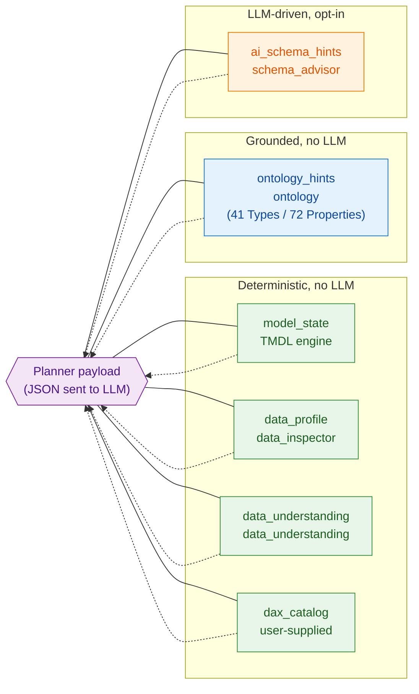
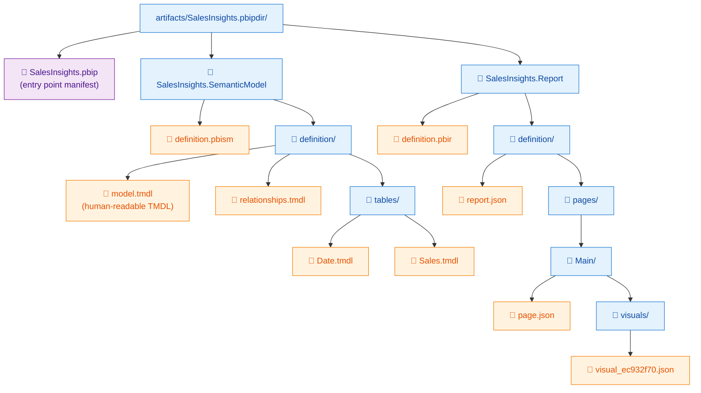
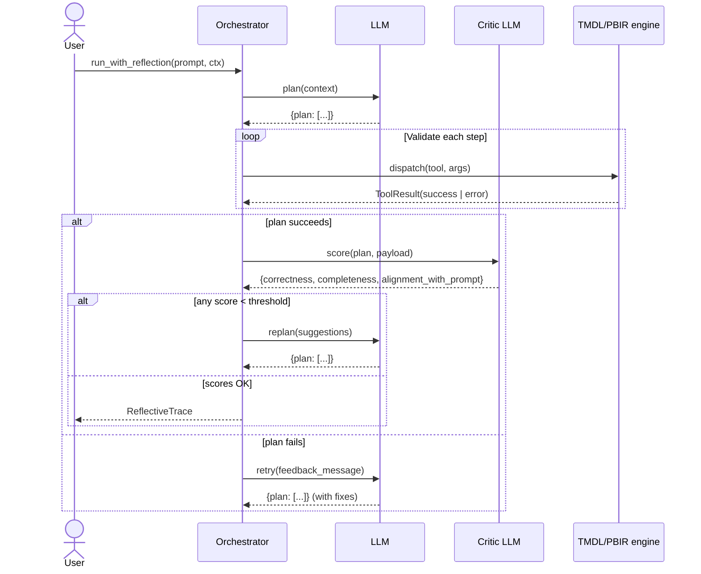
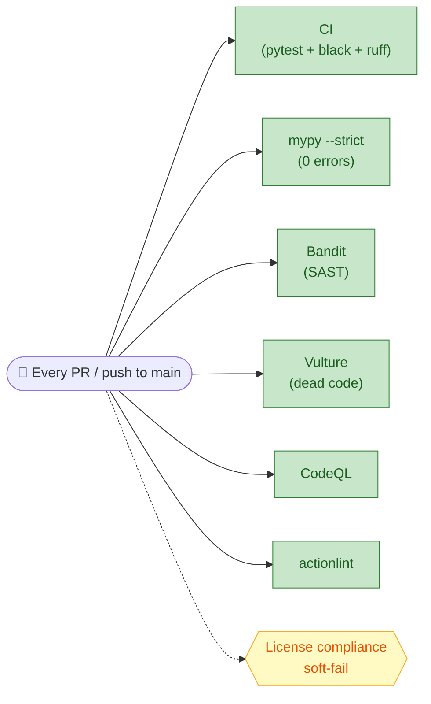
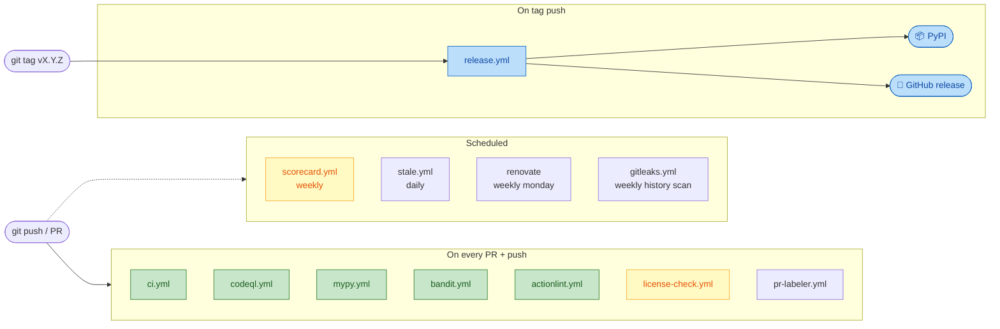
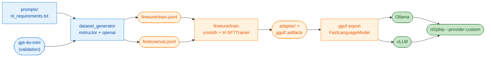
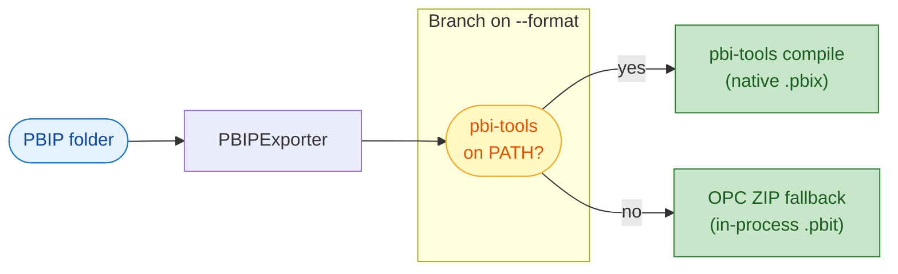

# nl2pbip

**Natural Language → Power BI Project (`.pbip`) engine.**

`nl2pbip` turns free-form analytics requirements into Git-friendly Power BI Project directories. It orchestrates an LLM planner, a TMDL writer, a PBIR layout engine, deterministic data inspection, a curated `schema.org` ontology, and an OPC-compliant `.pbit` exporter — so a single natural-language prompt produces:

- a **semantic model** in Tabular Model Definition Language (TMDL)
- a **report surface** in PBIR JSON (pages, visuals, bindings)
- a **packaged `.pbip` workspace** that can be exported to `.pbix` or `.pbit` and committed to a Microsoft Fabric Git repo

[](https://pypi.org/project/nl2pbip/)
[](#installation)
[](#license)
[](#test-counts)
[](https://github.com/rollroyces/nl2pbip/actions/workflows/ci.yml)
[](https://github.com/rollroyces/nl2pbip/actions/workflows/mypy.yml)
[](https://github.com/rollroyces/nl2pbip/actions/workflows/bandit.yml)

## Contents

- [What ships in v1.6.0](#what-ships-in-v160)
- [5-minute demo](#5-minute-demo-no-llm-required)
- [Install](#installation)
- [Quickstart](#quickstart--core-usage)
  - [CLI](#cli-cloud-hosted-llms)
  - [CLI (local inference)](#cli-local-inference-endpoints-ollama-vllm-lm-studio)
  - [Python API](#python-api-programmatic-generation-with-llm-context)
  - [Enable the prompt-polish layer](#enable-the-prompt-polish-layer-recommended-for-production)
  - [Use from an MCP-compatible agent](#use-from-an-mcp-compatible-agent-claude-code-cursor-copilot-cli)
- [Architecture](#architecture)
- [Planner prompts](#planner-prompts)
- [LLM context layer](#llm-context-layer)
- [Worked example](#worked-example-prompt--plan--tmdl)
- [Output structure](#what-you-get-output-structure)
- [Code quality gates](#code-quality-gates)
- [CI/CD integration](#cicd-integration)
- [Project layout](#project-layout)
- [Test counts](#test-counts)
- [Performance & cost](#performance--cost)
- [Performance benchmarks](#performance-benchmarks)
- [Fine-tuning module](#llm-fine-tuning-module-nl2pbipfinetune)
- [Export engine](#export-engine-pbip--pbix--pbit)
- [Troubleshooting](#troubleshooting)
- [Limitations](#limitations)
- [Next steps](#next-steps)
- [License](#license)

---

## What ships in v1.6.0

| Capability | What it gives you |
|---|---|
| **OpenTelemetry tracing** (`[telemetry]` extra) | Stdlib-only fallback by default; opt-in install pulls `opentelemetry-api`, `opentelemetry-sdk`, and `opentelemetry-exporter-otlp-proto-http`. Exposes `nl2pbip.run` root span + `nl2pbip.run_with_reflection`, `nl2pbip.llm.chat`, `nl2pbip.plan_chunk` children. Token-budget spend lands as `nl2pbip.budget.spend` / `nl2pbip.budget.exceeded` events on the current span. `NL2PBIP_OTEL_EXPORTER=console` writes JSON spans to stderr; `=otlp_http` ships to Jaeger / Tempo / Honeycomb via the configured endpoint. Zero behaviour change when disabled; mypy-strict clean on the slim CI runner. |
| **All v1.5.0 capabilities** | Below — left intact for posterity. |

| From v1.5.0 | What it gave you |
|---|---|
| **TMDL feature expansion** | Calculation groups + dynamic format strings (`formatStringDefinition`), Object-Level Security (Sept 2025 grammar), field parameters, Power Query (M) partitions with 6 source templates + 4 transformations. |
| **Fabric Git integration** | `package_pbip` writes `itemMetadata.json` + `.platform` per Fabric item. Validated against the 21 canonical Fabric item types. |
| **Agentic self-reflection loop** | `Orchestrator.run_with_reflection` records attempts in a `ReflectiveTrace`, runs a post-success critic pass (`correctness` / `completeness` / `alignment_with_prompt`), re-invokes the planner if scores are below threshold. `PlannerClarification` lets the LLM ask the user clarifying questions. |
| **Pre-LLM prompt polish layer** | `DefaultPromptPolisher` runs 7 deterministic scrub passes (encoding, whitespace, length budget, PII, secret, prompt-injection, term canonicalisation) before every LLM call. Pluggable via the `PromptPolisher` ABC + `register_polisher()`. |
| **Multi-provider cost guardrails** | `TokenBudget` + per-provider pricing tables in `nl2pbip.pricing` track cumulative LLM spend; `--max-cost-usd N` (default 10.0) CLI flag and `Orchestrator(max_cost_usd=N)` abort with `BudgetExceededError` once spend crosses the cap. Tiktoken-based token counting with a 4-char heuristic fallback when tiktoken isn't installed. |
| **Streaming plan execution** | `Orchestrator(plan_chunk_size=N)` slices the generated plan into N-step chunks; the optional `on_plan_chunk_complete` callback fires between chunks so callers can log progress, snapshot state, or push partial results to a queue. CLI surface via `--plan-chunk-size N` (default 0 keeps the legacy single-shot flow). |
| **Lightweight RAG for `model_state`** | When the model already has tables AND the caller has registered focus hints (data-source keys, recent lint errors), the orchestrator emits only the relevant subset plus a stable `content_hash` instead of dumping the full state. Opt-out via `context["model_state_rag_enabled"]=False`. |
| **MCP server** (`[mcp]` extra) | Exposes the generator as a Model Context Protocol server over **stdio or streamable-http** JSON-RPC. Four tools: `generate_report` (full NL → `.pbipdir`), `validate_pbip` (round-trip validator), `inspect_dataset` (CSV / JSON / JSONL / Parquet profiler), `version` (handshake). Drop into Claude Code, Cursor, or GitHub Copilot CLI via `mcpServers` config (stdio) or any HTTP-capable client (streamable-http, loopback-only by default — tunnel it via Tailscale / ssh -L / WireGuard). Same env-var credential strategy as the CLI. Pass `include_artifact=True` to `generate_report` to receive the packaged `.pbip` as base64 zip over the wire. |
| **Type safety** | **0 errors under `mypy --strict`** (down from 77 baseline). Gated by CI since v1.3.5. Heavy ML deps excluded via `[tool.mypy.overrides]`. |
| **Security automation** | 11 GitHub Actions workflows cover CI matrix, CodeQL, actionlint, OpenSSF Scorecard, stale bot, mypy --strict, Gitleaks, Bandit (gating), Vulture (gating), `pip-licenses`, PR labeler. Renovate runs as a separate weekly config. See [CI/CD integration](#cicd-integration). |
| **11 PyPI releases** | `v1.1.0` … `v1.5.1` live at https://pypi.org/project/nl2pbip/ before this release; `v1.6.0` lands here once the tag push fires `release.yml`. Trusted publishing via OIDC — no API token in the repo. |

The full history of capabilities and the changelog are in [`CHANGELOG.md`](./CHANGELOG.md).

---

## 5-minute demo (no LLM required)

```bash
python -m nl2pbip.example_run
```

A deterministic 7-step pipeline that uses a built-in mock LLM, runs the full TMDL + PBIR + package flow, and writes to `artifacts/SalesInsights.pbipdir`. No API key, no network, ~1 second:

```mermaid
flowchart LR
    classDef step fill:#e3f2fd,stroke:#1976d2,color:#0d47a1
    classDef measure fill:#fff3e0,stroke:#f57c00,color:#e65100
    classDef final fill:#c8e6c9,stroke:#2e7d32,color:#1b5e20

    a["1 · add_report_page<br/>Main"]:::step
    b["2 · create_table<br/>Date"]:::step
    c["3 · create_table<br/>Sales"]:::step
    d["4 · add_measure<br/>Total Revenue"]:::measure
    e["5 · define_relationship<br/>Sales_Date"]:::step
    f["6 · add_visual<br/>clusteredColumnChart"]:::step
    g["7 · package_pbip<br/>SalesInsights.pbipdir"]:::final

    a --> b --> c --> d --> e --> f --> g

    output(["📁 artifacts/SalesInsights.pbipdir/"])
    g --> output
```



```text
Executed plan containing 7 steps.
- add_report_page:     {'status': 'success', 'page': 'Main'}
- create_table:        {'status': 'success', 'table': 'Date',  'columns': ['Date', 'Month', 'Year']}
- create_table:        {'status': 'success', 'table': 'Sales', 'columns': ['SaleId', 'Region', 'Amount', 'Date']}
- add_measure:         {'status': 'success', 'measure': 'Total Revenue'}
- define_relationship: {'status': 'success', 'relationship': 'Sales_Date_Date_Date'}
- add_visual:          {'status': 'success', 'visual_id': 'visual_ec932f70'}
- package_pbip:        {'status': 'success', 'project': 'SalesInsights'}
PBIP output located at: artifacts/SalesInsights.pbipdir
```

Open the result in Power BI Desktop (`File → Open → Browse → artifacts/SalesInsights.pbipdir/SalesInsights.pbip`) and you'll see a working report with a bar chart and a Date / Sales star schema. The directory is git-friendly — every file is plain JSON or plain text.

---

## Installation

```bash
pip install nl2pbip
```

Optional extras provide heavyweight dependencies only when you need them:

| Extra | Use when | Install |
|---|---|---|
| `[anthropic]` | Calling Claude via `anthropic.Anthropic` | `pip install "nl2pbip[anthropic]"` |
| `[mcp]` | Exposing the generator as a Model Context Protocol server (Claude Code, Cursor, Copilot CLI, custom agents) | `pip install "nl2pbip[mcp]"` |
| `[finetune]` | Running the fine-tuning module (datasets + Unsloth + transformers + trl) | `pip install "nl2pbip[finetune]"` |
| `[dev]` | Contributing (black, ruff, pytest, mypy, vulture, pip-licenses, type stubs) | `pip install "nl2pbip[dev]"` |

Verify the install and see the bundled example:

```bash
python -c "import nl2pbip; print('nl2pbip', nl2pbip.__version__)"
python -m nl2pbip.example_run
ls artifacts/SalesInsights.pbipdir/SalesInsights.pbip
```

> **Tip:** Install `pbi-tools` separately (`dotnet tool install --global TabularEditor.Tools.PBITools`) so `python -m nl2pbip.cli export --format pbix` works. Without it, the exporter automatically creates an OPC-compliant `.pbit` template.

---

## Quickstart & Core Usage

### CLI: cloud-hosted LLMs

`nl2pbip` ships an `argparse`-based CLI in `nl2pbip.cli`. Two commands: `generate` and `export`. Run `python -m nl2pbip.cli generate --help` for the full list of flags.

### CLI: local inference endpoints (Ollama, vLLM, LM Studio)

```bash
python -m nl2pbip.cli generate \
  --prompt "Marketing attribution model with creative/channel filters" \
  --provider custom \
  --base-url http://localhost:11434/v1 \
  --api-key «redacted:sk-…» \
  --model mistral-openorca \
  --workspace artifacts/workspace-local \
  --output artifacts/pbip-local
```

`StructuredLLMClient` only needs an OpenAI-compatible HTTP surface; the `custom` provider lets you point at self-hosted gateways with any placeholder API key.

### Python API: programmatic generation with LLM context

```python
from nl2pbip.orchestrator import Orchestrator, register_builtin_tools
from nl2pbip.tmdl_engine import MODEL_PATH_KEY
from nl2pbip.pbir_engine import REPORT_PATH_KEY
from nl2pbip.llm_client import StructuredLLMClient

ctx = {
    MODEL_PATH_KEY: "artifacts/workspace/model.tmdl",
    REPORT_PATH_KEY: "artifacts/workspace/report.json",
    "project_name": "SalesInsights",
    "package_path": "artifacts/pbip-sales",
    "data_sources": {
        "Customer": [
            {"customerEmail": "alice@bigco.com", "firstName": "Alice",
             "customerSince": "2022-03-15", "countryCode": "US"},
            {"customerEmail": "bob@bigco.com", "firstName": "Bob",
             "customerSince": "2023-01-10", "countryCode": "GB"},
        ],
        "Order": [
            {"orderId": "A1", "orderDate": "2024-01-15", "total": 99.99,
             "customerEmail": "alice@bigco.com"},
            {"orderId": "A2", "orderDate": "2024-02-20", "total": 149.50,
             "customerEmail": "alice@bigco.com"},
        ],
    },
}

llm = StructuredLLMClient(provider="openai", model="gpt-4o-mini")
orch = Orchestrator(llm_client=llm)
register_builtin_tools(orch)

results = orch.run("Build a sales report with revenue per customer", context=ctx)
print(results[-1].output["project_path"])
```

The orchestrator returns structured `ToolResult` objects so you can inspect intermediate tool outputs, log them, or enforce custom compliance checks before persisting artifacts.

### Enable the prompt-polish layer (recommended for production)

```python
from nl2pbip.orchestrator import Orchestrator
from nl2pbip.prompt_polisher import DefaultPromptPolisher

orch = Orchestrator(
    llm_client=llm,
    prompt_polisher=DefaultPromptPolisher(),
)
```

Every attempt in the resulting `ReflectiveTrace` carries a `PolishReport` provenance record so you can audit what was scrubbed:

```python
trace = orch.run_with_reflection("...", context=ctx)
for a in trace.attempts:
    print(a.attempt, a.polish_steps, a.polish_redactions)
```

Tune the budget with `DefaultPromptPolisher(max_chars=...)`. Disable individual passes with `enable_secret_redact=False` etc.

### Type & visual handling

The TMDL handler accepts both schema.org-native and SQL-flavored spellings — aliases resolve to the canonical form:

```python
TMDLColumn(name="id",     data_type="bigint")   # → int64
TMDLColumn(name="price",  data_type="money")    # → decimal
TMDLColumn(name="region", data_type="varchar")  # → string
```

Visual-type aliases work the same way:

```python
add_visual_handler(page="Main", visual_type="table",  ...)  # → tableEx
add_visual_handler(page="Main", visual_type="matrix", ...)  # → pivotTable
add_visual_handler(page="Main", visual_type="pie",    ...)  # → pieChart
```

`define_relationship_handler` validates endpoint columns exist, data types are compatible, cardinality is valid, and no duplicate active relationship shares a from-side endpoint.

### Use from an MCP-compatible agent (Claude Code, Cursor, Copilot CLI)

Install the `[mcp]` extra and register the server with your client:

```bash
pip install "nl2pbip[mcp]"
```

Then add to your MCP client config (e.g. `~/.config/claude/mcp_servers.json`, `.cursor/mcp.json`, or `.github/copilot/mcp.json`):

```json
{
  "mcpServers": {
    "nl2pbip": {
      "command": "python",
      "args": ["-m", "nl2pbip.mcp_server"],
      "env": {
        "NL2PBIP_LLM_PROVIDER": "openai",
        "OPENAI_API_KEY": "sk-..."
      }
    }
  }
}
```

The server speaks stdio JSON-RPC and exposes four tools:

| Tool | Purpose | LLM call? |
|---|---|---|
| `generate_report` | Full NL → `.pbipdir` pipeline (mirrors `nl2pbip generate --prompt ...`) | Yes |
| `validate_pbip` | Walk an existing `.pbip` folder, run `PBIRValidator` over every page + visual | No (safe for CI) |
| `inspect_dataset` | Profile a CSV / JSON / JSONL / Parquet source for planner context | No |
| `version` | Library + prompt version handshake | No |

Credential strategy mirrors the CLI exactly — `NL2PBIP_LLM_PROVIDER` plus the provider's env vars (`OPENAI_API_KEY`, `ANTHROPIC_API_KEY`, etc.). The two no-LLM tools (`validate_pbip`, `inspect_dataset`) run cleanly in CI on every PR. Start the server manually with `nl2pbip-mcp` (console script) or `python -m nl2pbip.mcp_server` for debugging.

### Streamable-HTTP transport (v1.6.0)

For remote agent stacks (containers, hosted endpoints, custom gateways) the MCP server also exposes the same four tools over HTTP:

```bash
nl2pbip-mcp --transport streamable-http --host 127.0.0.1 --port 8000
```

Loopback-only by default — the server assumes the operator is exposing it via a trusted tunnel (Tailscale, WireGuard, `ssh -L`). To accept remote MCP clients directly, run behind a reverse proxy with auth of your choice. Set `host=0.0.0.0` only when you have a real network boundary in place.

When the client has no filesystem access to the server (most HTTP deployments), pass `include_artifact=True` to `generate_report` so the response carries the packaged `.pbip` as a base64-encoded zip:

```python
result = await session.call_tool("generate_report", {
    "prompt": "monthly revenue by region",
    "workspace": "/tmp/nl2pbip",
    "include_artifact": True,
})
with open(result["artifact_filename"], "wb") as fh:
    fh.write(base64.b64decode(result["artifact_zip_b64"]))
```

The zip is capped at 50 MB by default (`max_artifact_bytes`); oversized artifacts fall back to returning `project_path` only with a warning, so a runaway plan can't OOM the JSON-RPC frame.

#### Authentication (v1.7.0)

The streamable-http transport is unauthenticated by default — the loopback-only binding still applies, so the no-auth posture is safe when paired with a trusted tunnel (Tailscale, WireGuard, `ssh -L`). To accept remote MCP clients directly, set a Bearer token via the `NL2PBIP_MCP_BEARER_TOKEN` env var or the `--bearer-token $TOKEN` CLI flag (the flag wins when both are set):

```bash
export NL2PBIP_MCP_BEARER_TOKEN="$(openssl rand -hex 32)"
nl2pbip-mcp --transport streamable-http --host 127.0.0.1 --port 8000
```

Every request to `/mcp` must then carry `Authorization: Bearer <token>`. Missing or wrong tokens get `401 Unauthorized` with `WWW-Authenticate: Bearer realm="nl2pbip-mcp"`, **before** any MCP session is established — so an attacker can't even probe the JSON-RPC surface. The token comparison uses `hmac.compare_digest` (constant-time) rather than `==` to avoid leaking the valid token's prefix length via timing. The stdio transport is unaffected — auth only applies to HTTP.

Generate a token with `openssl rand -hex 32` (or any 32+ char random string). The token is plaintext in the env var; rotate by restarting the server with a new value. Stdio clients (Claude Code, Cursor, Copilot CLI) are unchanged.

---

## Architecture


The 13 TMDL handlers, grouped by responsibility:



The ontology ships 41 schema.org Types + 72 Properties + 71 alias entries + 9 PROV-O terms (<100 KB, no external deps). The data_inspector + data_understanding pair gives the LLM primary-key detection, FK coverage with orphan counts, cardinality hints, numeric quantiles, and time ranges.

---

## Planner prompts

Every string the orchestrator sends to the LLM lives in `nl2pbip.prompts`. Current version is **v7** (incremented across v1.1.0 → v1.3.5 with power-query, OLS, field-param, fabric, agentic-reflection, pre-flight-scrubbing, and anti-patterns rules).


| Symbol | Purpose |
|---|---|
| `REPORT_GENERATION_SYSTEM_PROMPT` | The 39-rule system prompt (v7). Covers output contract, narrative composition, visual selection by data shape, layout, measure–visual pairing, filters, and TMDL/security rules. Sub-rule 21a covers field-parameter switching; 23a/b/c cover Power Query; rule 27 covers OLS; rule 31 (added v6) documents the pre-flight polisher; rules 32–35 (added v7) list anti-patterns. |
| `LEGACY_GENERIC_SYSTEM_PROMPT` | The original 9-rule generic prompt, preserved verbatim for callers that opt out. |
| `select_system_prompt(context)` | Returns the focused prompt by default, or the legacy prompt if `context["report_focus_enabled"] = False`. The returned string is prefixed with `[nl2pbip prompt vN (name)]` so callers can log / pin the version. |
| `build_user_message(user_prompt, payload)` | Assembles the user-side message: `user_prompt + indented JSON payload`. |
| `build_feedback_message(error)` | Retry-feedback with type-specific guidance for `TMDLValidationError` and `PBIRValidationError`. |
| `CRITIC_SYSTEM_PROMPT` + `build_critic_user_message(...)` | Reflection-loop critic prompt + payload builder. `run_with_reflection` invokes the critic after a successful run and scores the plan on `correctness` / `completeness` / `alignment_with_prompt`. |
| `prompt_metadata(context)` | Returns `{version, name, focused_on_report_generation}` for the planner payload's `prompt_meta` block. |
| `PROMPT_VERSION` / `PROMPT_CHANGELOG` | Numeric version and append-only changelog. Tests assert the current version has an entry so silent drift is caught. |

Visual-selection rules (a sample of what's in the prompt):

| Data shape | Visual type |
|---|---|
| Single scalar | `card` or `kpi` (with comparison target if YoY) |
| Categorical comparison | `barChart` (horizontal if labels long) or `columnChart` |
| Trend over time | `lineChart` / `areaChart` / `ribbonChart` |
| Two-variable distribution | `scatterChart` |
| Geographic | `map` |
| Hierarchical breakdown | `treemap` or `decompositionTree` |
| Parts of whole (≤6 slices) | `pieChart`; ≤8 → `donutChart`; otherwise sorted `barChart` |
| Multi-dimensional grid | `pivotTable`; flat row × column → `tableEx` |
| Process funnel | `funnel` |
| Single value vs target | `gauge` or `kpi` |

---

## LLM context layer

The orchestrator assembles a planner payload that gives the LLM enough structure to design relationships and visuals with concrete numbers rather than guessing. Six orthogonal blocks:



| Block | Source | What it tells the LLM |
|---|---|---|
| `model_state` | TMDL engine | Existing tables, columns, types, relationships |
| `data_profile` | `data_inspector` | Per-column stats: distinct counts, top examples, numeric range, null rate |
| `ontology_hints` | `ontology` | schema.org vocabulary anchor — `customerEmail` → `schema.org/email` |
| `data_understanding` | `data_understanding` | PKs, FK coverage (orphan counts), cardinality hints, numeric quantiles, time ranges |
| `ai_schema_hints` | `schema_advisor` | LLM's own assessment of column roles + measure + visual suggestions |
| `dax_catalog` | user-supplied | Organisation-specific DAX patterns the planner should prefer |

Example payload shape with 3 tables (Customer, Order, Product) and 8 Order rows:

```json
{
  "model_state":      { "tables": {...}, "relationships": [...] },
  "data_profile":     { "tables": [{ "name": "Order", "columns": [...] }] },
  "ontology_hints":   { "columns": { "customerEmail": [{"iri": "schema.org/email", "score": 1.0}] }},
  "data_understanding": {
    "primary_keys":        [{ "table": "Order", "column": "orderId", "confidence": "strong" }],
    "relationship_coverage": [{
      "from_table": "Order", "from_column": "customerEmail",
      "to_table": "Customer", "to_column": "customerEmail",
      "matching_rows": 7, "orphan_rows": 1, "coverage_ratio": 0.875,
      "cardinality_hint": "manyToOne"
    }],
    "numeric_distributions": [{
      "column": "total", "p25": 88.7, "p50": 134.8, "p75": 281.3,
      "skew": "right", "likely_outliers": 1
    }],
    "time_ranges": [{ "column": "orderDate", "min_date": "2024-01-15", "max_date": "2024-05-30" }]
  },
  "ai_schema_hints":  { "column_semantics": [...], "measure_suggestions": [...], "visual_suggestions": [...] },
  "dax_catalog":      { "patterns": [...] }
}
```

Every block is **optional** (set the corresponding context flag to `False` to opt out) and computed **deterministically** — no LLM call required unless `ai_schema_hints` is enabled and an LLM client is wired up.

---

## Worked example: prompt → plan → TMDL

**Prompt:**

> "Create a sales insights dashboard with date intelligence and region breakdowns."

**LLM plan** (excerpt of the `{"plan": [...]}` array):

```json
[
  {"tool": "add_report_page", "args": {"page": "Main", "display_name": "Sales Insights"}},
  {"tool": "create_table", "args": {"table_name": "Date", "columns": [
    {"name": "Date",  "dataType": "date"},
    {"name": "Month", "dataType": "string"},
    {"name": "Year",  "dataType": "wholeNumber"}
  ]}},
  {"tool": "create_table", "args": {"table_name": "Sales", "columns": [
    {"name": "SaleId", "dataType": "string"},
    {"name": "Region", "dataType": "string"},
    {"name": "Amount", "dataType": "decimal"},
    {"name": "Date",   "dataType": "date"}
  ]}},
  {"tool": "add_measure", "args": {"table_name": "Sales", "measure_name": "Total Revenue",
    "expression": "SUM(Sales[Amount])", "format_string": "$#,0.00"}},
  {"tool": "define_relationship", "args": {"from_table": "Sales", "from_column": "Date",
    "to_table": "Date", "to_column": "Date",
    "cardinality": "oneToMany", "cross_filter_direction": "singleDirection"}},
  {"tool": "add_visual", "args": {"page": "Main", "visual_type": "clusteredColumnChart",
    "bindings": {"Category": {"expr": {"Column": {"Expression": {"SourceRef": {"Entity": "Sales"}}, "Property": "Region"}}},
                 "Y": {"expr": {"Measure": {"Expression": {"SourceRef": {"Entity": "Sales"}}, "Property": "Total Revenue"}}}}}},
  {"tool": "package_pbip", "args": {"output_path": "artifacts/SalesInsights.pbipdir",
    "project_name": "SalesInsights"}}
]
```

**Resulting `model.tmdl`:**

```text
table Date
  column Date  dataType = date       formatString = "yyyy-MM-dd"
  column Month dataType = string
  column Year  dataType = wholeNumber formatString = "#,0"

table Sales
  column SaleId dataType = string
  column Region dataType = string
  column Amount dataType = decimal    formatString = "#,0.00"
  column Date   dataType = date       formatString = "yyyy-MM-dd"
  measure "Total Revenue"
    expression = SUM(Sales[Amount])
    formatString = "$#,0.00"
```

The orchestrator wrote 7 step results, 9 JSON / TMDL files (model, relationships, 2 tables, report, page, visual, plus the `.pbip` / `.pbism` / `.pbir` manifests), and ran the full validation chain (TMDL column-name uniqueness, relationship endpoint existence, type compatibility, visual-type canonicalisation) before persisting any file. Failed validations roll the whole step back and retry with a feedback message that names the missing field or wrong type.

---

## What you get (output structure)



Everything is plain text or JSON — diff-friendly in git, reviewable in pull requests, parseable by other tools. To package as a single binary, run `python -m nl2pbip.cli export --input … --format pbix --output …` (requires `pbi-tools`) or `--format pbit` for the in-process fallback.

### Self-reflection loop

When you call `Orchestrator.run_with_reflection(...)`, the orchestrator runs the plan, scores it with a critic LLM, and re-invokes the planner if scores are below threshold. Each attempt is recorded in a `ReflectiveTrace` so you can audit what changed:



---

## Code quality gates

The codebase runs through six deterministic quality gates on every PR + push to `main`. Five are blocking; one is advisory today but will become blocking as the long-tail cleanup lands.



| Gate | Status | What it enforces |
|---|---|---|
| **CI** (pytest + black + ruff + smoke test) | **Gating** | Python 3.10 / 3.11 / 3.12 matrix. `tests/test_repo_templates.py` enforces README / docs / workflow parity. |
| **mypy --strict** | **Gating** since v1.3.5 | Type-checks `nl2pbip/` with `disallow_untyped_defs`, `disallow_any_generics`, `warn_unused_ignores`, `warn_redundant_casts`, `no_implicit_optional` on. Excludes `nl2pbip.finetune.*` + `nl2pbip.providers.*` + `openai` + `anthropic` via `[tool.mypy.overrides]`. **0 errors**. |
| **Bandit** | **Gating** since v1.3.2 | Python SAST (B101, B311, B404, B603, B615, etc.). 6 known-justified findings carry `# nosec <id> — <reason>` comments. SARIF uploads to the Security tab. |
| **Vulture** | **Gating** since v1.3.2 | Dead-code detection at confidence ≥80%. |
| **License compliance** | Soft-fail → **Gating** once UNKNOWN-free | `pip-licenses --fail-on='GPL,LGPL,AGPL,SSPL,Commons-Clause,UNKNOWN'` runs on every change to `pyproject.toml`. |
| **CodeQL** | **Gating** | Weekly + per-PR Python security scanning. SARIF uploads. |
| **actionlint** | **Gating** | YAML lint of `.github/workflows/*.yml`. |
| **Gitleaks** | Posts SARIF | Secret scanning per commit + weekly history scan. |
| **OpenSSF Scorecard** | Posts score | Weekly 0–10 security audit. |

Local equivalents (after `pip install ".[dev]"`):

```bash
black --check .
ruff check .
vulture nl2pbip --min-confidence 80
bandit --ini .bandit -r nl2pbip
mypy --strict nl2pbip
piplicenses --fail-on='GPL,LGPL,AGPL,SSPL,Commons-Clause,UNKNOWN'
```

See [CI/CD integration](#cicd-integration) for the full workflow table.

---

## CI/CD integration

11 GitHub Actions workflows live under `.github/workflows/`:



| Workflow | Trigger | What it does |
|---|---|---|
| `ci.yml` | push / PR / `workflow_dispatch` | Pytest on Python 3.10 / 3.11 / 3.12, `black --check`, `ruff check`, example-run smoke test, Codecov upload, opt-in `benchmarks` job |
| `codeql.yml` | push / PR / weekly cron | Python security scanning (CodeQL); uploads findings to the Security tab |
| `release.yml` | tag push (`vX.Y.Z`) | Build sdist + wheel, `twine check`, publish to PyPI via trusted publishing (OIDC — no API token), create GitHub release |
| `renovate.json` | weekly Monday | Pip + GitHub Actions dependency updates (patch + minor grouped; auto-merge on patch if CI green; heavy ML extras ignored) |
| `actionlint.yml` | per PR + per push | Lints `.github/workflows/*.yml` for syntax + GH Actions context errors |
| `scorecard.yml` | weekly + manual | Posts a 0–10 security score to the Security tab and workflow run page |
| `stale.yml` | daily | Closes issues / PRs inactive for >60 days; exempt pinned, security, `documentation`, assigned-to-Royce |
| `mypy.yml` | per PR + per push to main (**gating**) | `mypy --strict` on `nl2pbip/` (excludes `finetune/` + `providers/`); posts the count + SARIF artifact |
| `gitleaks.yml` | per PR + push + weekly history | Scans every commit + git history for committed secrets (API keys, .env files, AWS creds). Posts a SARIF to the Security tab. Configured via `.gitleaks.toml`. |
| `bandit.yml` | per PR + push to main (**gating**) | Python SAST (B101, B311, B404, B615, etc.). SARIF to Security tab. Configured via `.bandit`. |
| `license-check.yml` | per PR + push (warning today, will become gating) | `pip-licenses --fail-on='GPL,LGPL,AGPL,SSPL,Commons-Clause,UNKNOWN'`. Uploads license-report.txt artifact. |
| `pr-labeler.yml` | per PR | `actions/labeler@v5` auto-applies 8 labels (`CI`, `Dependencies`, `Docs`, `Examples`, `Prompts`, `Core`, `Finetune`, `Tests`) based on files touched. `changed-files-labels-limit: 5` + `max-files-changed: 200` prevent runaway. |
| `vulture` | embedded in `ci.yml` | `vulture --min-confidence 80` runs as a `ci.yml` step |

For PyPI publishing via OIDC trusted publishing, configure the project at https://pypi.org/manage/account/publishing/ pointing at the `rollroyces/nl2pbip` repo, the `release.yml` workflow, and the `pypi` environment — no API token is stored in the repo.

> **Tip:** To cut a release locally without OIDC: `git tag -a v1.3.5 -m "..." && git push --follow-tags`, or `python -m build && twine upload dist/*` from a clone that has your PyPI token configured.

---

## Project layout

```
nl2pbip/
├── nl2pbip/
│   ├── __init__.py
│   ├── cli.py                  # argparse CLI (generate / export subcommands)
│   ├── orchestrator.py         # planner payload + retry loop + run_with_reflection
│   ├── llm_client.py           # OpenAI-compatible client + structured output
│   ├── prompts.py              # versioned LLM planner prompts (v7) — system,
│   │                           # user, feedback, critic
│   ├── prompt_polisher.py      # pre-LLM scrub passes (PII / secrets / injection)
│   ├── dax_catalog.py          # organisation-specific DAX patterns
│   ├── dax_library.json        # default DAX pattern library
│   ├── tmdl_engine.py          # 13 handlers (calc-group, OLS, field-param,
│   │                           # power-query, RLS, pattern-measure, page-layout)
│   ├── tmdl_linter.py          # TMDLValidationError
│   ├── pbir_engine.py          # PBIR layout, OPC-compliant .pbit archive
│   ├── pbir_validator.py       # PBIR schema + semantic checks
│   ├── m_builder.py            # 6 source templates (csv/sql/json/sharepoint/
│   │                           # odata/web) + 4 transformations (promoted/merge/
│   │                           # append/group)
│   ├── packager.py             # package_pbip_handler + Fabric metadata
│   ├── data_inspector.py       # per-column profiling + heuristic FK
│   ├── data_understanding.py   # PK, FK coverage, cardinality, quantiles, time
│   ├── data_types.py           # TMDL data-type aliases + format-string defaults
│   ├── ontology.py             # curated schema.org + PROV-O subset
│   ├── schema_advisor.py       # LLM-driven column-role / measure / visual hints
│   ├── visual_types.py         # PBIR visual-type aliases + default size
│   ├── example_run.py          # python -m nl2pbip.example_run (idempotent demo)
│   ├── py.typed                # PEP 561 marker
│   ├── exporter/
│   │   ├── exporter.py         # pbi-tools + .pbit fallback
│   │   ├── opc.py              # OPC primitives (Content_Types, manifest parts)
│   │   └── pbit_builder.py     # high-level PbitArchiveBuilder
│   ├── providers/
│   │   └── local_finetuned.py  # in-process fine-tuned model provider
│   ├── finetune/
│   │   ├── dataset_generator.py  # instructor + OpenAI synthetic data
│   │   └── train.py            # Unsloth + trl SFT + GGUF export
│   └── mcp_server/             # Model Context Protocol server (4 tools)
├── tests/                      # 981 pytest cases across 31 test files
├── artifacts/                  # example Run output (SalesInsights.pbipdir)
├── .github/                    # workflows, issue templates, CODEOWNERS,
│                               # renovate.json, labeler.yml, SECURITY.md, etc.
├── pyproject.toml
├── LICENSE                     # Commercial + Apache carve-out for pre-0af050c commits
├── CHANGELOG.md
└── README.md
```

---

## Test counts

Pytest collects **995 test cases across 32 test files** in CI (Python 3.10 / 3.11 / 3.12). Of those, **981 pass** on every supported Python version; the remaining 13 are skipped because the benchmarks in `tests/test_performance.py` are opt-in via `NL2PBIP_RUN_BENCHMARKS=1`. 3 additional tests in `tests/test_finetune.py` (not in the headline count) require the heavy `finetune` extra — install locally with `pip install ".[finetune]"` to run those 3. Run `pytest tests/ --no-header -q` to confirm locally.

| Module | Cases |
|---|---:|
| `tests/test_repo_templates.py` | 108 |
| `tests/test_data_types.py` | 90 |
| `tests/test_prompt_polisher.py` | 76 |
| `tests/test_visual_types.py` | 73 |
| `tests/test_power_query.py` | 65 |
| `tests/test_opc_export.py` | 49 |
| `tests/test_prompts.py` | 48 |
| `tests/test_ontology.py` | 42 |
| `tests/test_data_inspector.py` | 34 |
| `tests/test_object_level_security.py` | 32 |
| `tests/test_budget.py` | 32 |
| `tests/test_fabric_metadata.py` | 30 |
| `tests/test_agentic_reflection.py` | 29 |
| `tests/test_calculation_groups.py` | 27 |
| `tests/test_field_parameters.py` | 27 |
| `tests/test_data_understanding.py` | 24 |
| `tests/test_relationship_validation.py` | 23 |
| `tests/test_custom_visuals.py` | 16 |
| `tests/test_schema_advisor.py` | 16 |
| `tests/test_cli_smoke.py` | 15 (subprocess-based CLI help smoke) |
| `tests/test_partial_plan_recovery.py` | 15 |
| `tests/test_mcp_server.py` | 13 (MCP tool surface + round-trip validation) |
| `tests/test_mcp_server_e2e.py` | 13 (MCP round-trip via real FastMCP wire format) |
| `tests/test_mcp_server_v160.py` | 19 (streamable-http transport + base64 artifact return + Bearer-token auth) |
| `tests/test_performance.py` | 13 (opt-in via `NL2PBIP_RUN_BENCHMARKS=1`) |
| `tests/test_dax_catalog_cache.py` | 12 |
| `tests/test_polisher_integration.py` | 11 |
| `tests/test_plan_chunking.py` | 11 |
| `tests/test_orchestrator.py` | 8 |
| `tests/test_exporter.py` | 3 |
| `tests/test_llm_client.py` | 2 |
| `tests/test_finetune.py` | 3 (excluded from CI; needs `[finetune]` extra) |

Many tests are parametrised, which is why the function count is much lower than the case count. Run `pytest tests/ --collect-only -q` to see the breakdown locally.

The benchmark suite is opt-in to keep the default CI run fast:

```bash
NL2PBIP_RUN_BENCHMARKS=1 pytest tests/test_performance.py -s
```

### Developer shortcuts

A `Makefile` wraps the full CI-equivalent suite + the most common dev loops so you don't have to remember the exact command lines:

| Target | What it does |
|---|---|
| `make test` | `pytest + vulture + black --check + ruff check + mypy --strict + bandit` |
| `make lint` | `black --check + ruff check` (fast style-only feedback) |
| `make type` | `mypy --strict` only |
| `make bench` | `NL2PBIP_RUN_BENCHMARKS=1 pytest tests/test_performance.py -v -s` |
| `make example` | `python -m nl2pbip.example_run` (the bundled end-to-end demo) |
| `make clean` | `find . -type d -name __pycache__ -exec rm -rf {} +` |

All recipes use `.venv/bin/` paths so they work with the project's existing venv without requiring system-wide installs of black / mypy / ruff / bandit.

---

## Performance & cost

The orchestrator emits one LLM call per `run()` invocation (plus optional `ai_schema_hints` and `ontology_hints` enrichment calls). Rough budget for a single mid-complexity report (3 fact tables, 6 dimensions, 8 visuals, 4 measures, 4 relationships):

| Component | Tokens (in) | Tokens (out) | Cost @ gpt-4o-mini |
|---|---|---|---|
| System prompt | ~1,800 | — | ~$0.0003 |
| Planner payload (model_state + data_profile + data_understanding + ontology_hints + tools) | ~3,500 | — | ~$0.0005 |
| Plan output (7 steps, ~150 tokens each) | — | ~1,000 | ~$0.0006 |
| **Total per run** | **~5,300** | **~1,000** | **~$0.0014** |

Runtimes observed locally (M-series Mac, mock LLM): ~0.8 s for `example_run`. With a real LLM call over local network (Ollama): ~3–6 s. With OpenAI gpt-4o-mini over the public API: ~2–4 s depending on the planner payload size.

To reduce token spend:

- Skip `ai_schema_hints` (the deterministic profile already gives you column types and FK coverage): `context["ai_schema_hints_enabled"] = False`
- Skip `ontology_hints` if your column names are obvious: `context["ontology_hints_enabled"] = False`
- Skip `data_understanding` for tiny datasets (< 10 rows): `context["data_understanding_enabled"] = False`
- Pin the prompt version so retries don't re-load changelog data: read `prompt_meta.version` and pass it back via `context["prompt_version"]`

### Tracing (OpenTelemetry)

The orchestrator emits OTEL spans around every `run()`, `run_with_reflection()`, LLM call, plan chunk, and per-call spend. Install the optional extra and flip an env var:

```bash
pip install ".[telemetry]"
export NL2PBIP_OTEL_EXPORTER=console          # or "otlp_http" for Jaeger / Tempo
export NL2PBIP_OTEL_SERVICE_NAME=nl2pbip      # surfaced as span attribute
export NL2PBIP_OTEL_OTLP_ENDPOINT=http://localhost:4318  # OTLP/HTTP default
```

Spans land in your backend (Jaeger / Tempo / Honeycomb) with `nl2pbip.run` as the root and `nl2pbip.llm.chat`, `nl2pbip.plan_chunk`, `nl2pbip.budget.spend`, and `nl2pbip.budget.exceeded` as children / events. Telemetry is **opt-in and zero-cost when disabled** — no SDK imports, no startup latency, no behaviour change. See `tests/test_telemetry.py` for the supported attribute schema.

---

## Performance benchmarks

Opt-in benchmark suite (`NL2PBIP_RUN_BENCHMARKS=1`):

```bash
NL2PBIP_RUN_BENCHMARKS=1 pytest tests/test_performance.py -s
```

Numbers measured on an M-series Mac with Python 3.11; reproduced verbatim in `tests/test_performance.py` so callers can refresh them locally:

| Path | Median | Throughput |
|---|---:|---:|
| Writer (200-table model → TMDL text) | 0.9 ms | 1,148 ops/sec |
| Parser (200-table TMDL → model) | 62 ms | 16 ops/sec |
| Writer + parser round-trip | 60 ms | 17 ops/sec |
| Large file write (200 tables, disk I/O) | 63 ms | 16 ops/sec |
| Calc-group, 10 items | 0.4 ms | 2,596 ops/sec |
| Calc-group, 50 items | 1.75 ms | 573 ops/sec |
| Calc-group, 100 items | 3.5 ms | 288 ops/sec |
| Field-param render, 10 members | <0.01 ms | 338k ops/sec |
| Field-param render, 50 members | 0.01 ms | 89,718 ops/sec |
| OLS role render, 10 tables | 0.01 ms | 143k ops/sec |
| OLS role render, 50 tables | 0.03 ms | 30,769 ops/sec |
| Orchestrator end-to-end (10-step plan) | 7 ms | 140 ops/sec |
| Orchestrator with reflection loop | 7 ms | 143 ops/sec |

**Parser is ~70× slower than the writer** for the 200-table model. The bottleneck is column extraction and the `add_column` validation checks inside `_parse_table`. If you have models bigger than ~200 tables and need faster round-trip, profile with `cProfile` before optimising.

The reflection loop overhead is in the noise vs plain `run` (stub critic call is negligible vs planner + tool execution). See `tests/test_performance.py` for the full bench definitions.

---

## LLM Fine-Tuning Module (`nl2pbip.finetune`)

Fine-tune open-weight coders such as **Qwen 2.5 Coder 7B** on curated TMDL + PBIR schemas to run `nl2pbip` entirely offline. The module ships two scripts that you run as Python modules — there is no separate CLI:



**1. Synthetic dataset generation** — uses `instructor` + `openai` to capture validated ChatML records:

```bash
python -m nl2pbip.finetune.dataset_generator \
  --model gpt-4o-mini \
  --prompt-file prompts/nl_requirements.txt \
  --train-output finetune/train.jsonl \
  --val-output finetune/val.jsonl
```

**2. QLoRA training with Unsloth** — wraps `unsloth.FastLanguageModel`, `trl.SFTTrainer`, and Hugging Face datasets:

```bash
python -m nl2pbip.finetune.train \
  --train-file finetune/train.jsonl \
  --val-file finetune/val.jsonl \
  --output-dir finetune/output \
  --model-name unsloth/Qwen2.5-Coder-7B-Instruct \
  --epochs 2 \
  --batch-size 1 \
  --gradient-accumulation 4 \
  --export-gguf
```

The `--export-gguf` flag writes adapters + GGUF artifacts under `finetune/output/gguf/`:

```text
finetune/output/
├── adapter/           # LoRA adapter (PEFT)
├── checkpoints/       # intermediate epochs
└── gguf/              # GGUF export for Ollama / llama.cpp
```

Artifacts in `finetune/output/gguf` can be served through Ollama (`ollama create nl2pbip -f Modelfile`) or vLLM. Point `python -m nl2pbip.cli generate --provider custom --base-url http://localhost:8000/v1` at that endpoint for private inference.

---

## Export Engine (`.pbip` → `.pbix` / `.pbit`)

`PBIPExporter` stitches semantic + report directories into binary Power BI files. You can call it directly or via CLI:



### CLI exports

```bash
# Convert an existing PBIP directory to PBIX
python -m nl2pbip.cli export \
  --input artifacts/pbip-20240925/SalesInsights.pbipdir \
  --format pbix \
  --output dist/SalesInsights.pbix

# Generate a template (PBIT) during plan execution
python -m nl2pbip.cli generate \
  --prompt "Finance P&L with departmental RLS" \
  --export-format pbit \
  --export-output dist/FinanceTemplate.pbit
```

- `.pbix` exports require `pbi-tools` to be on `PATH`. The exporter streams `pbi-tools compile` and surfaces the log output.
- `.pbit` exports fall back to an **OPC-compliant** in-process ZIP that writes the canonical Power BI Desktop manifest parts:
  - `[Content_Types].xml` at the archive root with UTF-8 BOM
  - `Version`, `Metadata`, `Settings`, `SecurityBindings`, `DiagramLayout` at the root
  - `DataModelSchema` (TMSL JSON), `DataMashup` (8-byte magic header + embedded ZIP)
  - `Report/Layout` (collapsed JSON), optional `Report/StaticResources/...` and `Report/CustomVisuals/...`
  - Forward-slash paths everywhere (Windows `Compress-Archive` would break Power BI)

### Python API exports

```python
from nl2pbip.exporter import PBIPExporter

exporter = PBIPExporter()
pbip_dir = "artifacts/pbip-sales/SalesInsights.pbipdir"

if not exporter.export_with_pbi_tools(pbip_dir, "pbix", "dist/SalesInsights.pbix"):
    exporter.export_as_pbit_zip(pbip_dir, "dist/SalesInsights.pbit")
```

This dual-path approach lets CI or air-gapped build agents still emit templates even when `pbi-tools` is unavailable.

---

## Troubleshooting

Common failures and how to recover:

| Symptom | Likely cause | Fix |
|---|---|---|
| `Planner must return valid JSON.` | The LLM wrapped the JSON in prose or markdown code fences | Switch to a model with reliable JSON output (gpt-4o-mini, claude-3-5-sonnet, qwen2.5-coder); or use `custom` provider with a fine-tuned local model |
| `TMDLValidationError: Unsupported dataType: …` | LLM invented a non-canonical TMDL spelling | Aliases are auto-rewritten (`bigint` → `int64`, `money` → `decimal`); unknown spellings fail. Either fix the prompt, or extend `nl2pbip.data_types.DATA_TYPE_ALIASES` |
| `TMDLValidationError: Duplicate column name …` | LLM created two columns with the same name in one table | All duplicates are reported together; the LLM should rename in the retry loop. If persistent, fix the prompt to use distinct names |
| `PBIRValidationError: Unsupported visualType '…'` | LLM invented a non-canonical visual type | Aliases are auto-rewritten (`table` → `tableEx`, `matrix` → `pivotTable`); unknown types fail. Extend `nl2pbip.visual_types.VISUAL_TYPE_ALIASES` if needed |
| `Package_pbip result missing project_path` | Context dict didn't include `package_path` | Pass `package_path` in the context (CLI does this automatically from `--output`) |
| `Packaging requires 'model_path' within context.` | Same as above but for `model_path` | Pass `MODEL_PATH_KEY` ("model_path") in context, or run via CLI |
| `pbi-tools: command not found` | Trying to export `.pbix` without pbi-tools installed | `dotnet tool install --global TabularEditor.Tools.PBITools`, or use `--format pbit` for the in-process fallback |
| `Planner output must be a JSON array` | LLM returned an object but no `plan` field | Some models return `{"steps": [...]}`. The orchestrator accepts `{plan: [...]}` and bare arrays; other shapes fail |
| Retry loop exhausts `max_attempts` | LLM consistently produces bad output | Lower temperature, switch to a stronger model, or use `example_run.py` to see what a working plan looks like |
| All FK suggestions have `coverage_ratio < 0.5` | The data has heavy orphans, or the column name doesn't match the FK column | Inspect `data_understanding.relationship_coverage` for the actual orphan count; either fix upstream data or hand-write the relationship |

Inspecting the orchestrator's intermediate state is straightforward — `results` is a list of `ToolResult` objects with the full input/output for each tool call, and the planner payload carries the `prompt_meta` block so you can pin the prompt version.

---

## Limitations

What `nl2pbip` doesn't do well, as of v1.3.5:

| Limitation | Why | Workaround |
|---|---|---|
| **LLM can still invent bad column names.** Even with `model_state` and `data_profile` in the planner payload, models sometimes ignore them. | The orchestrator exposes the schema but doesn't force the LLM to use it. | Pin a known-good prompt version via `prompt_meta.version`; verify model state was sent by checking the planner payload dump |
| **Foreign-key detection is heuristic.** `data_inspector.suggest_relationships()` ranks by overlap of top-5 distinct examples. | Sampling rather than full scan keeps the inspector fast. | For critical FKs, provide more rows via `data_sources` or hand-write the relationship |
| **No built-in RAG / retrieval.** Every plan re-emits the full payload, even for tables that already exist in the model. | The orchestrator is stateless across runs by design — PBIP is git-versioned. | Closed in v1.4.0 — see [CHANGELOG.md](./CHANGELOG.md). |
| **Numeric distribution quantiles require ≥5 values.** A column with 3 rows returns no quantiles. | Quantiles on <5 values are statistically meaningless. | Provide more rows, or accept the empty `numeric_distributions` entry |
| **`dax_library.json` is loaded once per CLI run.** | The catalog is a static file; no hot reload. | Re-run the CLI / orchestrator with the updated library |
| **`.pbix` export requires `pbi-tools`.** The in-process fallback emits `.pbit`. | `pbi-tools` ships its own C# compiler we don't want to fork. | Use `--format pbit` when `pbi-tools` is unavailable |
| **Custom visuals not in the LLM context.** Power BI custom visuals need their `visualType` registered manually. | The visual-type list is curated, not exhaustive. | Extend `nl2pbip.pbir_validator._SUPPORTED_VISUALS` and `nl2pbip.visual_types.CANONICAL_VISUAL_TYPES` |
| **Streaming plan execution is best-effort, not strict transactional.** Mid-chunk failures leave the model in a partial state — the per-chunk `on_plan_chunk_complete` callback is one-way, no rollback hook. | Implementation keeps partial writes simple. | For very large plans, snapshot the model state before each chunk and roll back manually if a later chunk fails |

These are honest engineering limits, not aspirational gaps. Filing issues for any of them is welcome.

---

## Next steps

- **Install from PyPI:** `pip install nl2pbip` (or `pip install --upgrade nl2pbip` to get the latest). Live releases at https://pypi.org/project/nl2pbip/.
- **Verify your install:** `python -m nl2pbip.example_run` produces a working PBIP from the bundled mock LLM in ~1 second. Outputs to `artifacts/SalesInsights.pbipdir/`.
- **Browse `tests/test_prompts.py`** for the report-generation system prompt's content rules — every section keyword has a test that catches silent drift.
- **Browse `tests/test_data_understanding.py`** for a realistic end-to-end scenario with FK orphans and cardinality hints.
- **Browse `tests/test_repo_templates.py`** for the GitHub Actions templates — issue templates, PR template, Renovate config, labeler, etc.
- **Wire `python -m nl2pbip.cli generate` into deployment automation** (e.g., GitHub Actions + `pbi-tools push`) to continuously ship fully reproducible Power BI apps from natural-language specs.
- If you hit a runtime error, see [Troubleshooting](#troubleshooting) and [Limitations](#limitations) for common causes and workarounds.
- For token / cost budgeting, see [Performance & cost](#performance--cost).
- For raw throughput numbers, see [Performance benchmarks](#performance-benchmarks).
- Extend `dax_library.json` with your own calculation groups and measure templates so planners lean on approved logic.
- Register your raw data via `context["data_sources"]` so the LLM gets FK coverage, P50 of numeric columns, and schema.org vocabulary anchors rather than guessing.
- Pin a specific prompt version via the planner payload's `prompt_meta.version` block for reproducible plan generation.
- Use `Orchestrator.run_with_reflection(...)` instead of `Orchestrator.run(...)` for production calls — you get a `ReflectiveTrace` for debugging + a critic pass that catches plans where the LLM technically ran but missed the user's intent.

---

> **Roadmap:** Active phases are tracked in [CHANGELOG.md](./CHANGELOG.md). Deferred items + rationale are in [docs/ROADMAP_DEFERRED.md](./docs/ROADMAP_DEFERRED.md).

## License

`nl2pbip` is **commercial proprietary software**, © 2026 Royce. All rights reserved.

This repository is published for visibility and collaboration under the terms of a **Commercial License Agreement** that you must sign with the Licensor before using the Software. **No open-source license** (MIT, Apache-2.0, GPL, AGPL, BSD, MPL, etc.) is granted by the public repository — viewing the source does not grant you any right to use, copy, modify, or distribute it.

Files committed prior to [`0af050c`](https://github.com/rollroyces/nl2pbip/commit/0af050c23393b3a4605f71ea1c8f49ccdb9cc1fb) retain their original Apache License 2.0 grant as a continuing authorization (see `LICENSE` §5). New contributions from that commit onward are governed by the Commercial License terms in [`LICENSE`](./LICENSE).

To obtain a Commercial License Agreement, contact:

> Royce &lt;roycelam@umich.edu&gt;

Your agreement will define scope, duration, fees, support, confidentiality, warranties, and termination.

THE SOFTWARE IS PROVIDED "AS IS" WITHOUT WARRANTY OF ANY KIND.